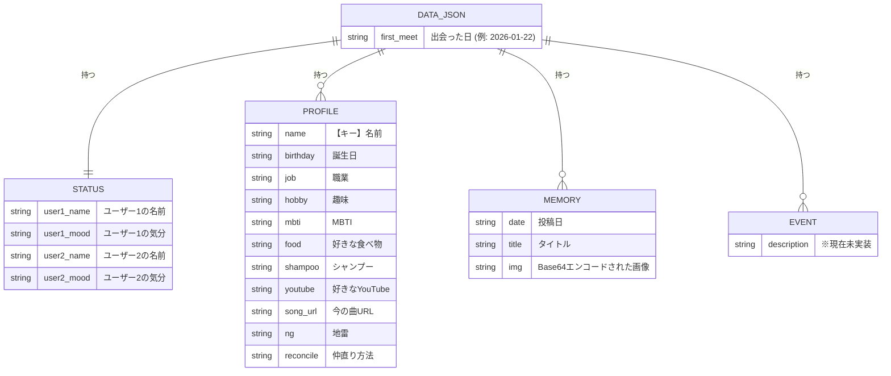
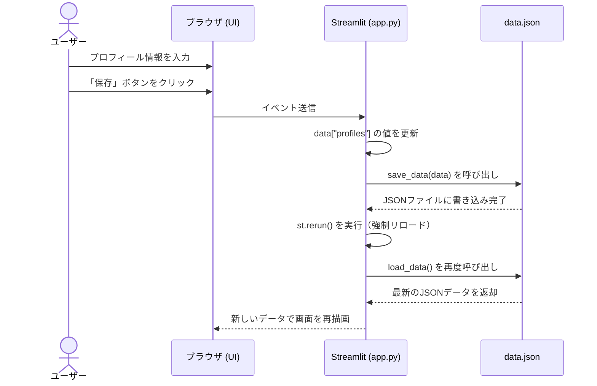
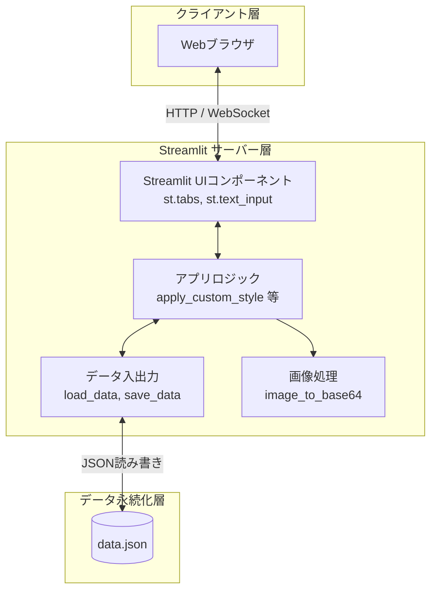
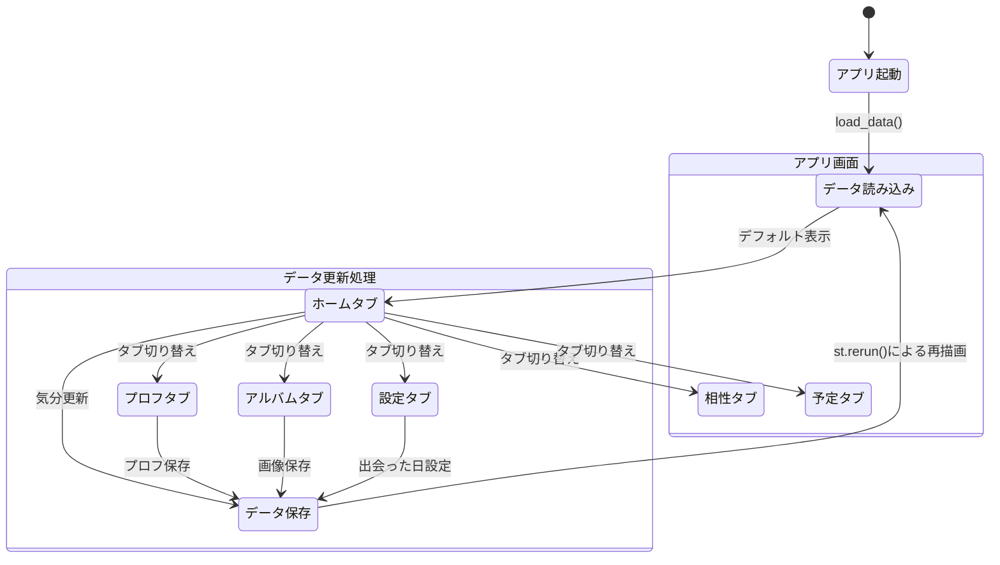

# restia アプリケーション設計図

このドキュメントは「仲良し子」アプリの設計とデータ構造を視覚化するための図（Mermaid形式）をまとめています。
GitHubなどのMarkdown対応エディタやプレビュー機能を使用することで図としてレンダリングされます。

## 1. ER図（データ構造図）
データベースの代わりに使用している `data.json` の構造と各要素の関連性です。

**【解説】**
このER図は、アプリの全データが保存されている `data.json` 内の構造を示しています。
ルートとなるJSONの直下に「出会った日（`first_meet`）」があり、さらに `status`（それぞれのユーザーの気分や名前）、`profiles`（ユーザーごとの詳細なプロフィール情報）、`memories`（アルバム機能の画像とタイトル）、`events`（現在は未実装）のリストや辞書がぶら下がっている形になっています。本来のリレーショナルデータベースのテーブルに見立てて視覚化しています。

## 2. シーケンス図（データの読み書きの流れ）
ユーザーがプロフィール画面で情報を入力し、保存する際の流れです。

**【解説】**
ユーザーが「プロフィールを保存する」などのアクションを起こした時の、アプリ裏側の処理の流れを表しています。
ブラウザから入力データが送られると、Streamlit側でPythonの辞書データを更新し、そのまま `data.json` ファイルを上書き保存します。その後、Streamlit特有の `st.rerun()` 関数が呼ばれることで、自動的に画面全体が最新のデータで再描画され、ユーザーの画面に変更が反映されるという一連のサイクルです。

## 3. コンポーネント図（システム構成）
このアプリを構成する主要な要素と、データ通信の構成です。

**【解説】**
システムがどのような技術や要素で成り立っているかを示す図です。
このアプリは大きく分けて「ユーザーが操作するブラウザ」「PythonとStreamlitで動くサーバー」「データが保存されるJSONファイル」の3層構造になっています。ユーザーがUIを操作すると、アプリのロジックが走り、必要に応じて画像処理モジュール（Pillow）を呼び出したり、ファイル入出力モジュールを通して JSON ファイルからデータを読み書きします。

## 4. 状態遷移図（画面遷移とアクション）
起動からの画面遷移と、データ保存に伴う再描画の状態変化です。

**【解説】**
アプリを起動してから、ユーザーがどのような画面を移動（遷移）できるかと、データの状態変化を表しています。
起動するとまずJSONからデータが読み込まれ、「ホームタブ」が表示されます。そこから上部のタブをクリックすることで各画面に移動できます。どの画面にいても、データを更新するボタン（気分更新、プロフ保存など）を押すと「データ更新処理」が走り、最終的に再描画されて元のタブの最新状態に戻る、というステート（状態）のループを示しています。
